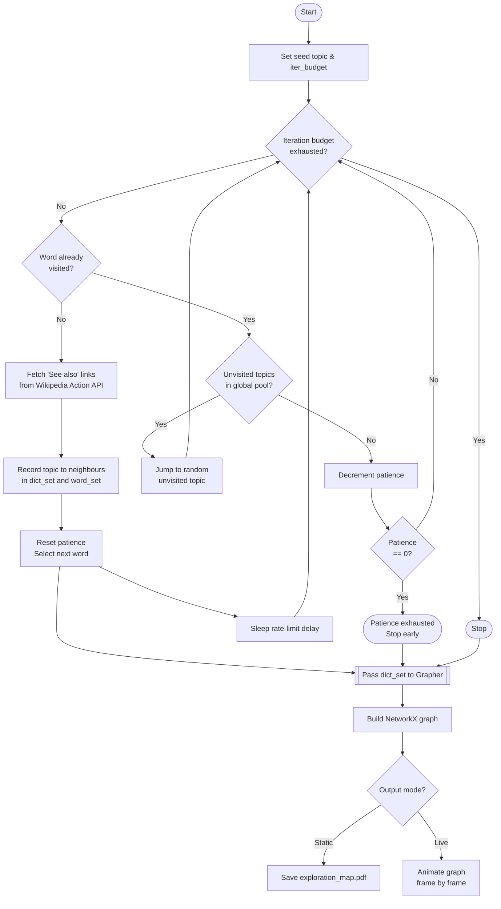

# Wiki-Grapher

Wiki-Grapher builds a knowledge graph by crawling Wikipedia's "See also" sections, starting from a seed topic and hopping through related articles. The result is visualised as a graph saved to a PDF (or rendered live as an animation).

> **Note:** Due to the sunset of Wikipedia's `/page/related` REST API, the crawler now uses the Action API to fetch links specifically from the **"See also"** section of each page. This results in a more curated, though potentially smaller, graph.

---

## How It Works

### Flowchart



### The Crawl Loop

Starting from a seed topic, the crawler repeatedly:
1. Fetches links from the "See also" section of the current topic via the Wikipedia Action API
2. Records the relationships in a dictionary (`topic → ["See also" links]`)
3. Selects the next topic to visit based on the crawler's strategy
4. Sleeps briefly between requests to respect rate limits

The loop runs for up to `iter_budget` iterations. If the crawler gets stuck (all known topics already visited), it jumps to a random unvisited topic from its global discovered pool. If no unvisited topics remain, it decrements a **patience** counter. When patience reaches zero, it stops early rather than burning the remaining budget uselessly.

### The Two Crawlers

| Crawler | Strategy | Best for |
|---|---|---|
| `Pathfinder` | Takes the first `limit` related pages at each hop. Navigates by random choice (default) or last item. | Focused, directed exploration |
| `Wanderer` | Randomly samples `limit` pages from all related pages at each hop. | Broad, unpredictable exploration |

Both crawlers share the same base logic (fetching, iteration, patience) defined in `WikiGraphBase`.

### The Grapher

After crawling, `Grapher` builds a NetworkX graph from the collected data and renders it:

- **Node colours**
  - Green — seed topic (starting point)
  - Red — topics directly crawled as key nodes
  - Blue — topics discovered as neighbours (not directly crawled)
- **Node size** — proportional to the node's degree (number of connections)
- **Output** — `exploration_map.pdf` by default (static), `exploration_map.html` (interactive), or a live animated window

---

## Project Structure

```
Wiki-Grapher/
├── src/
│   ├── main.py                          # Entry point
│   └── wiki_grapher/
│       ├── __init__.py                  # Public API: Pathfinder, Wanderer, Grapher
│       ├── constants/
│       │   ├── __init__.py
│       │   └── constants.py             # All shared constants and defaults
│       ├── crawler/
│       │   ├── base.py                  # WikiGraphBase — shared crawl logic
│       │   ├── pathfinder.py            # Pathfinder — sequential/random-choice crawler
│       │   └── wanderer.py              # Wanderer — random-sampling crawler
│       └── grapher/
│           ├── __init__.py
│           └── grapher.py               # Grapher — NetworkX + Matplotlib visualisation
├── requirements.txt
└── README.md
```

---

## Installation

```bash
pip install -r requirements.txt
```

---

## Usage

Edit `src/main.py` to configure your run, then execute:

```bash
python src/main.py
```

### Choosing a Crawler

```python
from wiki_grapher.crawler.pathfinder import Pathfinder
from wiki_grapher.crawler.wanderer import Wanderer

wiki_obj = Pathfinder()   # focused, directed
# wiki_obj = Wanderer()   # broad, exploratory
```

### Setting the Seed Topic and Budget

```python
wiki_obj.set_word("Shah_Rukh_Khan")   # Wikipedia page title (underscores for spaces)
wiki_obj.set_iter_budget(240)          # maximum number of crawl iterations
```

### Running the Crawl

```python
wiki_obj.wiki_iter(
    random_seed=0,   # 0 = random next hop, any other value = deterministic (last item)
    limit=3,         # max related pages to record per topic
    patience=5,      # consecutive stuck iterations tolerated before early stop (default 5)
)
```

**`patience` explained:** If the crawler exhausts all known unvisited topics, it decrements patience by 1 each stuck iteration. When patience hits 0, it prints `"Patience exhausted — stopping early."` and exits the loop cleanly. Set a higher value to let it explore longer before giving up.

### Visualising the Graph

```python
from wiki_grapher.grapher.grapher import Grapher

g = Grapher(
    dict_set=wiki_obj.dict_set,   # crawled data
    word=wiki_obj.word,           # seed topic (coloured green)
    monochrome=False,             # True = all nodes white (useful for print)
    labels=False,                 # True = show topic names on nodes
    size=40,                      # figure size in inches (square)
)

g.develop_graph()       # saves exploration_map.pdf
# g.live_graph(delay=2) # animated live graph, delay in seconds between frames
# g.animated_graph(delay=2) # structured animation (Empty -> Seed -> Expansion)
# g.develop_html_graph() # saves interactive exploration_map.html
```

---

## Output

The graph is saved as `exploration_map.pdf` in the working directory. Node size reflects the number of connections — highly connected topics appear larger. Use `monochrome=True` for a cleaner black-and-white export.
